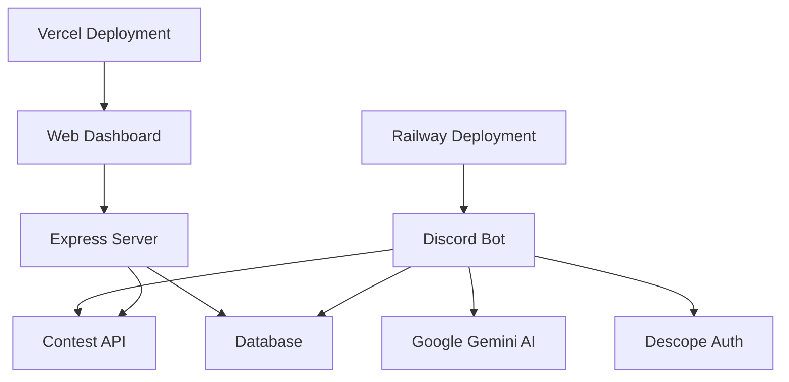

# 🤖 CodeMentorAI - The Ultimate Competitive Programming Assistant

<div align="center">


[](https://your-railway-url.railway.app/) [](https://codementor-ai-dashboard-anurag12sharmas-projects.vercel.app/) [](https://discord.com/oauth2/authorize?client_id=1408136900438528000&scope=bot+applications.commands&permissions=268954752) [](https://hackathon.example.com/)

**AI-powered Discord bot to supercharge your competitive programming journey: stay up-to-date with contests, get personalized study recommendations, and never miss a coding challenge!**

</div>

---

## ✨ Features

### 🏆 Real-Time Contest Tracking
- **Multi-Platform:** Codeforces, CodeChef, HackerEarth, LeetCode
- **Live Updates:** Auto-refresh with the latest contests and stats
- **Contest Search:** Filter by platform, keyword, or difficulty
- **Running Contests:** Track currently active competitions

### 🧠 AI-Powered Recommendations
- **Personalized Study Plans:** AI-suggested study paths
- **Smart Contest Suggestions:** Tailored for your skill level
- **Programming Tips:** Instant context-aware advice

### 🔔 Smart Reminders
- **Never Miss a Contest:** Automated notifications before start
- **Customizable Alerts:** Enable/disable reminders with simple commands

### 🌐 Modern Web Dashboard
- **Live Stats:** See upcoming & running contests in real time
- **Beautiful UI:** Built with EJS, Bootstrap, fully responsive
- **Bot Analytics:** Live metrics for users, servers, uptime

### 🔐 Secure by Design
- **Descope Outbound Apps:** Secure authentication for all API calls
- **API Protection:** Rate limiting and robust error handling

---

## 🛠️ Tech Stack

- **Backend:** Node.js, Express.js
- **Bot Framework:** Discord.js
- **AI/ML:** Google Gemini API (LLM)
- **Authentication:** Descope Node SDK
- **Dashboard:** Express, EJS, Bootstrap, Vercel hosting
- **Integrations:** CompeteAPI, Google Calendar API
- **Deployment:** Railway (bot), Vercel (dashboard)
- **Monitoring:** UptimeRobot

---

## 🚀 Quick Start

```bash
# 1. Clone the repository
git clone https://github.com/your-username/codementor-ai.git
cd codementor-ai

# 2. Install dependencies
npm install

# 3. Configure environment variables
cp .env.example .env
# Edit .env and fill in your Discord token, AI API key, etc.

# 4. Start the bot
npm start

# 5. Start the web dashboard (optional)
cd web
npm install
node server.js
```

---

## 💬 Commands & Usage

```bash
# Contest Commands
!contests          # Upcoming contests
!contests cf       # Codeforces only
!running           # Running/ongoing contests
!search string     # Search contests

# AI Commands
!schedule beginner      # Get a study plan
!tip "data structures" # Get AI programming tip

# Settings Commands
!remind-on          # Enable reminders
!remind-off         # Disable reminders
!help               # Full command list
```

---

## 🏗️ Architecture



---

## 🌐 Live Links

| Service | URL | Status |
|---------|-----|--------|
| Discord Bot | [Railway App](https://your-railway-url.railway.app/) | 🟢 Online |
| Web Dashboard | [Vercel Web](https://codementor-ai-dashboard.vercel.app/) | 🟢 Online |
| Invite the Bot  | [Invite Link](https://discord.com/oauth2/authorize?client_id=1408136900438528000&scope=bot+applications.commands&permissions=268954752)        | 🔗          |

---

## 📸 Screenshots & GIFs

<details>
<summary>Click to expand</summary>


> **Note:** Replace this placeholder with an actual bot screenshot showing the commands in action.


> **Note:** Replace this placeholder with a live dashboard GIF showing the real-time features.

</details>

---

## ⚡ Monitoring & Security

- **Descope Outbound Apps:** All external API usage is securely authenticated and monitored.
- **Health Check:** `/health` endpoint for deployment monitoring.
- **UptimeRobot:** 24/7 monitoring.

---

## 👥 About

Built with ❤️ by Anurag Sharma for the **Global MCP Hackathon 2025**.

**Contact:**  
- [Email](mailto:anurag2002sharma@gmail.com)  
- [LinkedIn](https://www.linkedin.com/in/anurag12sharma/)

---

## 🤝 Contributing

We welcome contributions from the community! Here's how you can help make CodeMentorAI better:

### Getting Started
1. **Fork the repository** and clone it locally
2. **Create a feature branch:** `git checkout -b feature/your-feature-name`
3. **Make your changes** and test them thoroughly
4. **Commit your changes:** `git commit -m "Add your descriptive commit message"`
5. **Push to your fork:** `git push origin feature/your-feature-name`
6. **Create a Pull Request** with a clear description of your changes

### What We're Looking For
- 🐛 Bug fixes and performance improvements
- ✨ New features that enhance the competitive programming experience
- 📚 Documentation improvements and examples
- 🎨 UI/UX enhancements for the web dashboard
- 🧪 Test coverage improvements

### Code of Conduct
Please be respectful and constructive in all interactions. We're building an inclusive community where everyone can learn and contribute.

### Questions & Discussions
Have ideas or need help? Join our [GitHub Discussions](https://github.com/anurag12sharma/codeMentor-ai/discussions) to connect with other contributors and share your thoughts!

---

## ❓ FAQ

### Common Setup Issues

**Q: The bot isn't responding to commands**
- Ensure your Discord bot token is correct in `.env`
- Check that the bot has proper permissions in your server
- Verify the bot is online in the Discord Developer Portal

**Q: Contest data isn't loading**
- Check your internet connection
- Verify that external APIs (CompeteAPI) are accessible
- Try the `!contests` command to refresh the data

**Q: AI features aren't working**
- Make sure your Google Gemini API key is valid and has quota
- Check the API key permissions in Google Cloud Console
- Ensure the bot has internet access for API calls

**Q: Web dashboard shows errors**
- Verify all environment variables are set correctly
- Check that the dashboard URL matches your deployment
- Ensure database connection is working if using persistent storage

**Q: How do I invite the bot to my server?**
- Use our [official invite link](https://discord.com/oauth2/authorize?client_id=1408136900438528000&scope=bot+applications.commands&permissions=268954752)
- Make sure you have "Manage Server" permissions
- The bot needs message and embed permissions to function properly

---

## 📄 License

MIT License

---

## 🙏 Acknowledgments

- Discord.js
- Google Gemini AI
- Descope
- CompeteAPI
- Railway, Vercel
- All hackathon judges and contributors!

---

**⭐ Star this repo if you found it helpful! [https://github.com/anurag12sharma/codeMentor-ai]**

---
