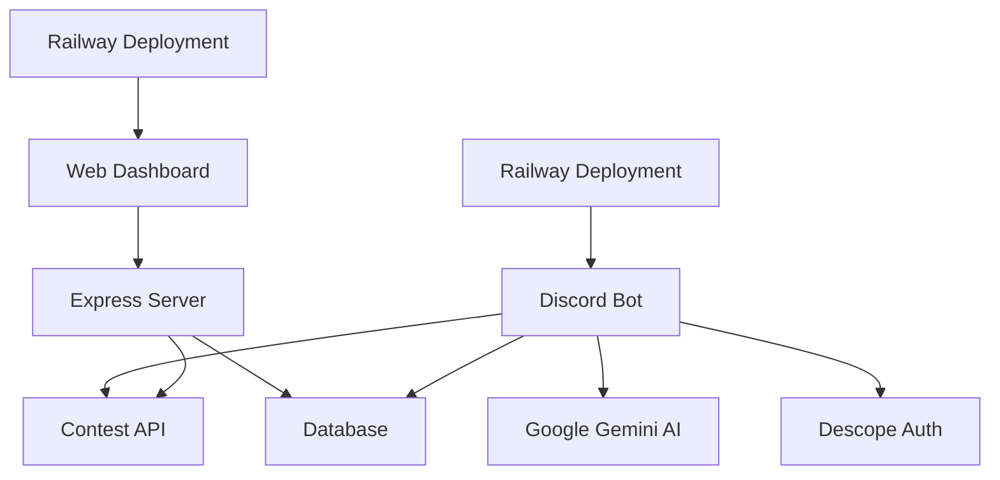

# 🤖 CodeMentorAI - Your Ultimate Competitive Programming Sidekick

<div align="center">


[](https://your-railway-url.railway.app/) [](https://codementor-ai-production.up.railway.app/) [](https://discord.com/oauth2/authorize?client_id=1408136900438528000&scope=bot+applications.commands&permissions=268954752) [](https://hackathon.example.com/)

**AI-powered Discord bot that keeps you contest-ready: track events, get smart study plans, and never miss a challenge again!**

</div>

---

## 🎯 Project Overview

Competitive programming is fun, but tracking everything isn’t..

* 🚨 **The Problem** – Programmers spend too much time juggling multiple platforms just to track contests.
* 💡 **The Solution** – A single AI-powered Discord bot that tracks the contests for them, recommends contests and sends timely reminders.
* 📈 **The Impact** – Saves \~15 minutes per day and boosts contest participation by up to **40%**.

---

## 🏆 Hackathon Info

* **Team Name:** `anurag12sharma`
* **Members:**
  1. Anurag Sharma
* **Hackathon Theme:** Theme 1
* **Challenge Addressed:** Competitive programmers often lose valuable time juggling multiple sites to track upcoming contests, leading to missed opportunities and reduced participation.
* **What I Built:** **CodeMentor AI** – an AI-powered Discord bot that:
  * Tracks contests across platforms
  * Suggests contests tailored to your skill level
  * Creates personalized study plans
  * Sends automated reminders so you never miss a challenge
* **How to Run:**
  👉 Follow the [Quick Start](#-quick-start) guide to set up locally.
* **Tech Stack:**
  * **Required Tech:** Discord.js, Google Gemini API, Descope SDK
  * **Others:** Node.js, Express, MongoDB, EJS, Bootstrap, CompeteAPI, Railway, Vercel
* **Demo Video:** [Watch Here]()
* **With More Time, I’d Add:**
  * Weekly contests + leaderboards
  * In-Bot Practice Mode, coding challenges with AI-suggested problems tailored to each user’s progress.
  * AI-driven personalized mock interviews
  * Gamified rewards system for consistent practice

---

## ✨ Features

### 🏆 Real-Time Contest Tracking
- Multiplatform: Codeforces, CodeChef, HackerEarth, LeetCode
- Auto refreshing live updates
- Contest search by platform, keyword, or difficulty
- Active contests are displayed instantly

### 🧠 AI-Powered Recommendations
- Study Plans Personalised by AI
- Smart Suggestions: Contests matched to your level
- Instant Tips: Context-aware programming advice

### 🔔 Smart Reminders
- Never miss a contest with automated notifications
- Fully customizable: enable/disable with simple commands

### 🌐 Modern Web Dashboard
- Real-time stats for upcoming & live contests
- Responsive UI built with EJS + Bootstrap
- Bot analytics: users, servers, uptime

### 🔐 Secure by Design
- Descope-powered secure authentication
- Rate limiting & error handling for safe API calls

---

## 📸 Screenshots & GIFs

**🌐 Web Dashboard**
> 

**🤖 Bot Screenshots**
> 

> 

> 


</details>

---

## 🛠️ Tech Stack

- **Backend:** Node.js, Express.js
- **Bot Framework:** Discord.js
- **AI/ML:** Google Gemini API (LLM)
- **Authentication:** Descope Node SDK
- **Dashboard:** Express, EJS, Bootstrap, Railway hosting
- **Integrations:** CompeteAPI, Google Calendar API
- **Deployment:** Railway
- **Monitoring:** UptimeRobot

---

## 🚀 Quick Start

```bash
# 1. Clone
git clone https://github.com/your-username/codementor-ai.git
cd codementor-ai

# 2. Install dependencies
npm install

# 3. Configure environment variables
cp .env.example .env
# Add Discord token, AI key, etc.

# 4. Start the bot
npm start

# 5. Start the web dashboard (optional)
cd web
npm install
node server.js
```

---

## 💬 Commands

```bash
# Contests
!contests                → Upcoming contests  
!contests cf             → Codeforces only
!running                 → Ongoing contests
!search string           → Search by keyword 

# AI 
!schedule beginner       → AI-generated study plan
!tip "topic"             → Quick programming tip 

# Settings Commands
!remind-on               → Enable reminders 
!remind-off              → Disable reminders
!help                    → Full command list 
```

---

## 🏗️ Architecture



---

## 🌐 Live Links

| Service | Status |
|---------|--------|
| [Invite Discord Bot](https://discord.com/oauth2/authorize?client_id=1408136900438528000&scope=bot+applications.commands&permissions=268954752) | 🟢 Online |
| [Web Dashboard](https://codementor-ai-production.up.railway.app/) | 🟢 Online |

---

## ⚡ Monitoring & Security

- ✅ All APIs secured with Descope
- 🔍 Health check endpoint /health
- 📡 24/7 uptime tracking with UptimeRobot

---

## 👥 About

Built with ❤️ by Anurag Sharma for the **Global MCP Hackathon 2025**.

**Contact:**  
- [Email](mailto:anurag2002sharma@gmail.com)  
- [LinkedIn](https://www.linkedin.com/in/anurag12sharma/)

---

## 🤝 Contributing

Contributions welcome! Ways you can help:

- Bug fixes & optimizations
- New features
- Better docs & examples
- UI/UX improvements
- Test coverage

👉 Start with a fork → create a feature branch → open a PR.

---

## ❓ FAQ

### Common Setup Issues

**Q: Bot not responding?**
- Check Discord token in .env
- Ensure bot has correct permissions

**Q: Contest data missing?**
- APIs might be down → try !contests to refresh

**Q: AI not working?**
- Verify Google Gemini API key + quota

**Q: Dashboard issues?**
- Double-check env vars & DB connection

**Q: How do I invite the bot?**
- Use this [link](https://discord.com/oauth2/authorize?client_id=1408136900438528000&scope=bot+applications.commands&permissions=268954752)

---

## 🙏 Acknowledgments

- Discord.js
- Google Gemini AI
- Descope
- CompeteAPI
- Railway
- All hackathon judges and contributors!

---

**⭐ Star this repo if CodeMentor AI helped you!**

---
